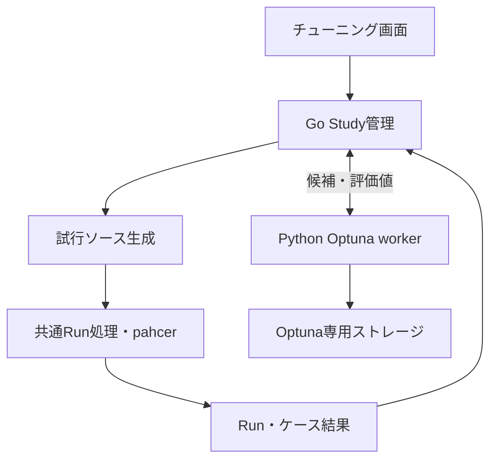

# AHC Plaza：Optunaによるハイパーパラメータチューニング実装方針

本書は実装提案。記載する `@tune` 構文、画面、API、CLIは新設する仕様であり、現時点の機能ではない。

## 1. 推奨方針

**C++の定数宣言に短いコメントを付け、GUIで探索範囲を確認して開始する。試行ごとにソースのコピーの初期値だけを変更し、既存のpahcer実行基盤で評価する。**

```cpp
constexpr int BEAM_WIDTH = 50;        // @tune 10 200
constexpr double START_TEMP = 100.0;  // @tune 1 1000 log
```

利用者が書くのは、原則として調整したい定数ごとのコメントだけ。専用ヘッダー、`main()`への初期化処理、環境変数・コマンドライン引数の読み取り、Pythonの目的関数は不要にする。

最大のトレードオフは**試行ごとにC++の再コンパイルが必要**なこと。まず通常の提出コードと同じ定数・最適化条件を維持できる方式を完成させる。コンパイル時間が実測で問題になった段階で、実行時注入方式を追加する。

「C++の追加記述ゼロ」と「任意の定数の意図・適切な探索範囲まで自動認識」は両立しない。対象の指定と探索範囲の決定は必要であり、短いコメントとGUIで負担を小さくする。

## 2. 現在の構造と接続先

| 現在の実装 | 確認した動作 | チューニングへの利用 |
| --- | --- | --- |
| `web/src/App.svelte` | 実行・履歴・比較・入力・設定のタブを持つSvelte UI | 「チューニング」を追加し、Run詳細と比較へ接続 |
| `internal/usecase/run.go` | 設定読込、入力列挙、ソース保存、workspace作成、pahcer実行、結果保存 | 固定した実行条件からRunを作る共通処理を抽出 |
| `internal/snapshot/snapshot.go` | 単一ソースのコピーとSHA-256を保存 | Study開始時の原本と各試行の生成ソースを保存 |
| `internal/pahcer/workspace.go` | ソースを`main.cpp`にコピー、toolsと入力を配置、実行設定を書き換え | Trialごとに独立したworkspaceを作る |
| `internal/pahcer/runner.go` | `pahcer run --json --setting-file ...`を実行 | ビルド・テスター・スコア抽出は既存設定を利用 |
| `internal/usecase/results.go` | pahcerのseedを入力ケースに対応付け、WA/TLEに`invalid_score`を設定 | 対応付けを再利用し、完全性の検証を追加 |
| `internal/store/` | SQLiteでRun・入力・ケース結果を管理 | StudyとTrialの関連情報を追加 |
| `internal/server/server.go` / `run_handlers.go` | 非同期Run、キャンセル、SSE、起動時の未完了Run処理 | Studyのライフサイクルを統合 |

調査元：[Run実行](https://github.com/taigatappuri/AHC-Plaza/blob/ceb422f580bc352b255aa9e2f1937f7ad1aef184/internal/usecase/run.go)、[workspace](https://github.com/taigatappuri/AHC-Plaza/blob/ceb422f580bc352b255aa9e2f1937f7ad1aef184/internal/pahcer/workspace.go)、[結果変換](https://github.com/taigatappuri/AHC-Plaza/blob/ceb422f580bc352b255aa9e2f1937f7ad1aef184/internal/usecase/results.go)、[サーバー](https://github.com/taigatappuri/AHC-Plaza/blob/ceb422f580bc352b255aa9e2f1937f7ad1aef184/internal/server/server.go)、[画面](https://github.com/taigatappuri/AHC-Plaza/blob/ceb422f580bc352b255aa9e2f1937f7ad1aef184/web/src/App.svelte)。

現状に合わせ、最初はLinux・g++・単一C++ソースを対象にする。複数翻訳単位やプロジェクト独自ヘッダーの収集は別の拡張とする。現在の対応環境は[README](https://github.com/taigatappuri/AHC-Plaza/blob/ceb422f580bc352b255aa9e2f1937f7ad1aef184/README.md)を参照。

## 3. 利用者の操作

1. C++の調整したい定数に`@tune`コメントを付ける。
2. 「チューニング」でソースと入力セットを選ぶ。
3. 自動検出されたパラメータ表で範囲を確認し、「開始」を押す。
4. 現在値の評価後、Optunaが候補を提案して実行を繰り返す。
5. 最良候補を現在値と比較し、必要なら別入力セットで検証する。
6. 「最良値を入れたC++を保存」で、そのままコンパイルできるソースを取得する。

標準画面に出す設定は「ソース」「入力セット」「パラメータ表」「試行回数」の4つを中心にする。最大化・最小化は既存の`project.objective`を継承して表示する。並列数、時間予算、サンプラーの乱数seedは詳細設定にまとめる。

試行回数の初期値は100という製品上の仮値とし、開始前には「100候補 × 50ケース、加えて現在値50ケース」のように実行量を表示する。推定所要時間は現在値の評価後に更新し、ビルド時間も含める。

検証済みPython本体・Optuna・必須依存を配布バイナリに圧縮同梱し、初回チューニング時に専用環境を自動展開する。利用者による追加インストールや初回の追加ダウンロードは不要。通常のRun実行は専用環境未展開でも従来どおり動く。

## 4. C++側の記法

### 4.1 基本構文

```cpp
constexpr int BEAM_WIDTH = 50;        // @tune 10 200
const double START_TEMP = 100.0;      // @tune 1 1000 log
int ITERATIONS = 1000;                // @tune 100 3000 step=100
double PENALTY = 0.25;                // @tune 0.0 1.0 step=0.05
```

| 要素 | 仕様 |
| --- | --- |
| `@tune LOW HIGH` | 両端を含む探索範囲。整数・実数は宣言の型から判別 |
| `log` | 対数スケール。上下限は正。`step`との併用は不可 |
| `step=N` | 刻み幅。正の値。整数は省略時1、実数は省略時連続値 |
| 宣言の初期値 | 現在値・比較基準。範囲外でも基準評価は可能 |
| `@tune`のみ | 対象だけ指定し、探索範囲をGUIで入力。未入力なら開始不可 |

`LOW <= HIGH`を要求し、同値は固定パラメータとして扱う。刻み指定時は上限が刻みに一致することを開始前に検証する。GUIの暗黙の丸めで探索範囲を変えない。

Optuna側は`IntDistribution`と`FloatDistribution`へ変換する。型別の刻みと対数指定の制約は[Trial API](https://optuna.readthedocs.io/en/stable/reference/generated/optuna.trial.Trial.html)に合わせる。

### 4.2 初版の対応範囲

- グローバルスコープの、1行・1変数・`=`初期化の宣言。
- 型は`int`、`long long`、`float`、`double`。`const`、`constexpr`、`static`の付与を許す。
- 初期値は符号付き10進数リテラル。小数、指数表記、対応する`f`/`LL`サフィックスを許す。
- 注釈付きパラメータ名はファイル内で一意とする。
- 型別の範囲と有限値を検証する。初版の整数探索は宣言型の範囲内かつ絶対値`2^53 - 1`以下に制限する。64bit整数の全域対応はOptuna内部を含む精度検証後の拡張とし、範囲外を黙って丸めない。

初版では`auto`、型エイリアス、`#define`、配列、複数変数宣言、関数内・クラス内の宣言、条件付きプリプロセッサ領域内の注釈、式による初期化は対象外にする。未対応の注釈を見つけたら無視せず、行番号と修正例を示す。

```cpp
// 初版では対象外
constexpr int WIDTH = 1 << 8;  // @tune 64 512

// 対応する書き方
constexpr int WIDTH = 256;     // @tune 64 512
```

### 4.3 初期値の置換

ソース全体に対する正規表現置換は使わない。文字列、raw文字列、文字リテラル、コメント、プリプロセッサ行、括弧・スコープを識別する字句走査を用意し、対応する宣言だけを解析する。行継続など未対応の構文が対象宣言にかかる場合は拒否する。

解析結果として、名前・型・初期値・範囲・行番号・初期値のバイト位置を保持する。試行ごとに固定原本を読み、バイト位置の後ろから初期値トークンだけを差し替える。無関係な同値リテラル、コメント、改行コード、変数参照は変更しない。

生成する数値はロケール非依存で、型に対応したサフィックスと十分な桁数を持たせる。`float`は型変換後の実際の値も記録する。置換前の原本ハッシュとトークンを確認し、一致しなければ停止する。

`constexpr`は保持されるため、配列サイズ・テンプレート引数等にも使える。ただし探索値によってコンパイルできなくなる場合はあり、そのTrialをビルド失敗として扱う。

### 4.4 設定の二重管理を避ける

コメントから読んだ設定を初期値としてパラメータ表に出し、GUIで変更した範囲はチューニングプロファイルへ保存する。ソースを自動で書き戻さない。「コメントの設定に戻す」を用意する。

解決順は「今回のGUI指定 → 保存プロファイル → コメント」。プロファイルにソースハッシュと宣言の識別情報を持たせ、ソース変更時は差分を表示する。名前が一致しただけで以前の設定を自動適用しない。Study開始時には解決済み設定を固定する。

完全にコメントを追加したくない利用者向けには、同じ宣言解析器で検出した定数をGUIから選択する方式を第2段階で追加できる。ただし任意のC++式を自動理解する機能とはしない。

## 5. 方式の比較

| 方式 | 利用者の追加記述 | `constexpr`維持 | 試行ごとの再ビルド | 判断 |
| --- | --- | --- | --- | --- |
| コメント＋コピーの初期値置換 | パラメータごとに短いコメント | 可 | 必要 | **初版で採用** |
| 専用マクロ＋環境変数 | ヘッダー導入と宣言変更 | 実行時値では不可 | 原則不要 | 大量試行向けの将来案 |
| CLI引数・JSON読込 | 読込・代入処理の実装 | 実行時値では不可 | 原則不要 | 標準操作として要求しない |
| `-D`による値指定 | マクロ化と既定値の仕組み | 可 | 必要 | 今回の使いやすさでは優位性が小さい |
| 全定数の自動選択・置換 | ソース編集ゼロ、GUIで選択 | 可 | 必要 | 対象選択と誤検出対策を整えて後から追加 |

コピーの自動変換で環境変数読み込みを注入する案もあるが、定数式として使われる箇所や最適化条件を変えてしまう。初版では暗黙に切り替えない。

## 6. システム構成

Goが実行と状態遷移を管理し、PythonはOptunaの候補生成とStudy記録を担当する。Python側から既存HTTP APIやCLIを毎回呼ぶ構成にはしない。



### 6.1 既存Run処理の共通化

現在の`ExecuteRun`は毎回設定と入力ディレクトリを読み直すため、そのままTrialのループから呼ぶだけでは途中の編集が混入する。次の責務に分割する。

| 提案する責務 | 内容 |
| --- | --- |
| `PrepareRunInputs` | 設定解決、ソース・入力・tools・pahcer設定の固定 |
| `ExecutePreparedRun` | 固定済みソースと入力一覧からworkspace作成、実行、結果保存 |
| `EvaluateTuningRun` | 全ケースの検証と目的関数の算出 |
| `TuningManager` | 候補取得、Trial作成、停止・再開、最良候補の更新 |

関数名は提案。従来の`ExecuteRun`も共通処理を呼ぶようにし、通常RunとTrialの実行経路が分岐し続けることを避ける。

各Trialは既存Runとして保存し、`study_id`・`trial_number`との関連を追加する。最良候補の詳細、ケース出力、ビジュアライザ、現在値との比較には既存UIを使う。通常の履歴一覧はTrialを既定で除外し、「チューニングを含む」で表示可能にする。現在の一覧は100件上限なので、Trialで通常Runが押し出されないクエリへ変更する。

### 6.2 ビルドとworkspace

生成ソースは各Trialの独立した場所に保存し、既存の`main.cpp`配置とpahcerのビルド設定を使う。Study開始時に、ビルド設定が生成した`main.cpp`を実際にコンパイルする対応形式か検証する。絶対パスの別ソースや独自ビルドスクリプトは黙って受け入れず、対応する入力契約を追加するまで対象外とする。

初版はTrialごとにworkspaceを分離する。現在の`PrepareWorkspace`はtools全体をコピーするため、容量と準備時間を計測する。最適化する場合も入力とtoolsの固定コピーをStudyに一度保存し、書込可能な生成物はTrialごとに分離する。ビルドされるファイルへの安易な共有ハードリンクは使わない。

### 6.3 Python workerとOptuna

Studyごとに常駐Pythonプロセスを起動し、標準入出力でバージョン付きJSON Linesを交換する。Optunaログは標準エラーへ出す。リクエストID、応答期限、エラー型、メッセージサイズ上限を定義する。

| 操作 | 役割 |
| --- | --- |
| `init` / `load` | Study作成・読込、探索空間と評価条件の同一性確認 |
| `ask` | `study.ask(fixed_distributions=...)`で候補を取得 |
| `tell` | Trial番号と値・終端状態を通知 |
| `get_trial` / `list_trials` | 再開時の状態照合 |
| `best` | 最良の完了Trialを取得 |

実行ループを外部で管理する用途には、Optunaの[Ask-and-Tell](https://optuna.readthedocs.io/en/stable/tutorial/20_recipes/009_ask_and_tell.html)が対応している。Trial番号を保存し、評価後に`tell`する。[Study API](https://optuna.readthedocs.io/en/stable/reference/generated/optuna.study.Study.html)

サンプラーは`TPESampler`、乱数seedは固定可能にする。初期ランダム探索数は明示的に10に設定する提案とし、ライブラリの暗黙の既定値に依存しない。複数Trialの同時実行を追加する際は`constant_liar=True`を明示する。[TPESampler API](https://optuna.readthedocs.io/en/stable/reference/samplers/generated/optuna.samplers.TPESampler.html)

初版の永続化はStudyごとの`optuna.sqlite3`とする。**Optunaストレージへのアクセスは1つのworkerに直列化**し、GoのRun用DBとファイルを分ける。これは複数OptunaプロセスでSQLiteを共有する設計ではない。将来、複数workerが直接ストレージを更新するならJournalStorageまたはRDBへ切り替える。Optuna公式はSQLiteでの並列最適化を推奨していない。[FAQ](https://optuna.readthedocs.io/en/stable/faq.html#how-can-i-solve-the-error-that-occurs-when-performing-parallel-optimization-with-sqlite3)、[JournalStorage](https://optuna.readthedocs.io/en/stable/reference/generated/optuna.storages.JournalStorage.html)

### 6.4 依存環境

Python本体・Optunaと必須依存・worker・ライセンス文をGo配布バイナリに圧縮同梱する。初回利用時にPlaza専用ディレクトリへ原子的に展開し、絶対パスでPythonを起動する。システムPython、PATH、ユーザーのパッケージ環境を変更しない。GUIと`ahc-plaza tune setup`は同じオフライン展開処理を呼ぶ。配布資材はバージョンとSHA-256を固定し、amd64/arm64別にビルド時だけ取得する。

READMEとGUIにPython同梱・配布容量・展開後容量・保存場所・削除方法を明示する。通常機能の利用では展開しない。旧環境の削除手段を用意し、Pythonと全依存のライセンスおよびセキュリティ更新もPlaza側で管理する。開発用の資材なしビルドは通常機能を維持し、チューニングだけ未同梱と表示する。正式配布と`make build`は資材を必須にする。

通常の`doctor`には「チューニング用環境：未設定」を任意機能として表示し、`doctor --tuning`で必須チェックする。リリースごとにPython・Optunaの対応バージョンをテストして固定し、自動的に最新へ更新しない。具体的な採用バージョンは実装時の互換性テストで確定する。

## 7. 評価の定義

### 7.1 初版の目的関数

固定したNケースの生スコアの算術平均を使う。同一ケース集合なら合計とは順位が一致する。

```text
objective_value = sum(score[i] for i in fixed_cases) / N
project.objective = "max" → Optuna direction = "maximize"
project.objective = "min" → Optuna direction = "minimize"
```

問題ごとの公式最終スコアとローカル生スコアの集計が一致するとは限らない。画面には「目的値：生スコア平均」と明示する。ケースごとの尺度差が大きい問題向けの基準比・対数比集計は第2段階とし、採用時は基準Runを固定してゼロ・負値の扱いを別途定義する。探索中の最良値を分母にして目的関数を変化させない。

### 7.2 不正解・欠落を有利にしない

現状では結果JSONが見つからない場合に`buildCaseResults`が`nil, nil`を返す。また不正解には設定値`invalid_score`が入るため、最小化で既定値0を使うと不正解を有利に評価し得る。チューニングでは通常表示用平均値をそのまま目的関数にしない。

| 結果 | 初版での処理 |
| --- | --- |
| 全ケース成功、重複・欠落なし、全スコア有限 | `COMPLETE`として平均値を`tell` |
| WA・TLE・実行時エラーが1件でもある | `FAIL`、目的値なし。次の候補へ |
| コンパイルエラー | 当該Trialを`FAIL`。ログを表示 |
| 結果JSONなし・破損・ケース不足・重複・範囲外seed | `FAIL`。成功ケースだけで平均しない |
| Pythonやpahcer未導入、ディスク書込失敗など基盤障害 | Studyを停止し原因を表示 |
| ユーザーの中断 | Plaza側では`cancelled`、Optuna側では`FAIL`、理由を保存 |

`FAIL`はTPEに「悪い評価値」として学習されるわけではない。そのため有効な候補が少ない探索では非効率になる。初版は正しく動く範囲に絞る運用とし、5回連続失敗で自動停止する。将来、制約付き最適化等を追加する場合も、不正解への便宜的なゼロ代入はしない。

既存の`RunSummary`は目的値を返さないので、Go内部で保存済みCaseResultを取得して集計する。CLIのstdoutをスコアとして解釈しない。

### 7.3 現在値と検証

開始時に現在値を固定した同じ条件で評価し、比較基準Runとして保存する。初版ではOptunaのTrialには含めず、設定した100試行は追加候補100回を意味する。失敗Trialも回数に数える。基準が全ケース成功しなければ探索を開始しない。

現在値も採用候補に含め、探索結果が悪化した場合は「現在値が最良」と表示する。最良Trialを無条件に採用させない。

探索に使っていない別入力セットで、現在値と選択した候補を同一条件で比較できるようにする。検証結果はOptunaへ戻さず、探索値と別に表示する。同じ検証セットを繰り返し見ながら選び直すと過適合し得るため、最終確認用ケースは温存する。

## 8. 実行速度と再現性

### 8.1 並列化

初版は**同時Trial数1、Trial内のケース並列のみ**とする。コンパイルの同時多発を避け、先の評価を受けて次の候補を生成する。比較するRunは同じ並列数・タイムアウトで実行する。

既存の`threads=0`はチューニング開始時に具体的な値へ解決して保存する。提案する自動設定は利用可能CPU数の半分を切り上げ、上限4・下限1。これは快適さを優先した仮値であり、実測で調整する。時間打切り型のsolverではCPU負荷がスコアに影響するため、最終検証はケース並列1を選べるようにする。

通常Runとチューニングには共通の実行枠を設け、初版は同一プロジェクト内の重い評価をキューで直列化する。別端末からの起動もプロジェクト単位のプロセスロックで検出する。第2段階で同時Trial数を増やす場合は`trial_jobs × case_threads`に総上限を設ける。

### 8.2 入力と乱数

Study開始時に、ソース、入力ファイルの内容と順序、pahcer設定、tools、実行条件を保存する。以降はその固定コピーを使う。現在の`InputCasesHash`だけでは元ファイルの書換えを防げないため、内容の保存が必要になる。

Optunaのseed、入力ジェネレータのseed、solver内部の乱数seedは別物。Optunaのseed設定だけではsolverを決定的にできない。初版ではsolver固有のseed注入は行わず、既存solverが固定seedを使う場合はそれを維持する。将来、乱数seedの反復評価を追加する際は明示的な受渡し契約を設ける。

同じ候補の評価でも時間制限・OS負荷による変動は残るため、結果キャッシュは初版では無効にする。探索履歴の再開は保証対象とするが、無中断実行と全く同じ候補列になる保証はしない。サンプラー内部乱数状態の保存は別の課題である。並列実行時の非決定性についても[Optuna FAQ](https://optuna.readthedocs.io/en/stable/faq.html#how-can-i-obtain-reproducible-optimization-results)を参照。

### 8.3 枝刈り

初版は`NopPruner`とし、途中打切りを実装しない。現在はpahcer終了後に結果JSONを読む構造なので、`MedianPruner`を指定するだけでは途中評価にならない。

第2段階で実装するなら、固定順の同じケース集合を同じ件数の節目で集計して`trial.report`する。途中平均が最終順位を適切に予測するかを検証し、途中までしか走らなかった候補を通常の完了Trialに混ぜない。

## 9. 保存・停止・再開

### 9.1 保存先とデータ

| 保存対象 | 提案する保存先・内容 |
| --- | --- |
| StudyのUI情報 | 既存`ahc-plaza.db`の`tuning_studies`：ID、状態、条件ハッシュ、予算、基準Run |
| TrialとRunの関連 | `tuning_trials`：Study ID、Optuna番号、Run ID、パラメータ、状態、目的値、失敗理由 |
| 送信待ち評価結果 | `tuning_outbox`：Trial番号、結果ハッシュ、終端状態、配信状態 |
| 固定条件 | `ahc-plaza/tuning/<study-id>/manifest.json`とソース・入力・toolsのコピー |
| Optunaの正本 | 同ディレクトリの`optuna.sqlite3`。Python workerだけが読み書き |
| 詳細な評価結果 | 既存`ahc-plaza/runs/<run-id>/`。各Trialの生成ソース・ログ・ケース出力 |
| 書き出し | Study配下の`exports/`。最良候補C++とパラメータJSON |

`UNIQUE(study_id, trial_number)`とRunとの一意な関連を設ける。OptunaのTrial番号とPlazaのRun番号は別物として表示する。Trialごとに出力が増えるため、Study詳細に使用容量を表示する。初版は再検証しやすさを優先して全結果を保存し、自動削除は導入しない。

manifestにはPlaza本体・workerの仕様版、ソース・入力・設定・toolsのハッシュ、パーサー仕様版、探索空間、目的関数版、最大化/最小化、ケース並列数、タイムアウト、コンパイラ・pahcer・Python・Optunaのバージョンを記録する。現在のRunではコンパイラとpahcerのバージョンが`unknown`で保存されるため、チューニング開始時に実値を取得する。

### 9.2 状態と停止

Studyは`preparing / running / stopping / paused / completed / failed`を持つ。ブラウザを閉じてもサーバーが動いていれば継続する。

- 「一時停止」：新規候補の取得を止め、実行中Trialの終了を待って`paused`。
- 「今すぐ停止」：プロセス群を終了し、当該Trialを中断として記録して`paused`。
- 回数・時間予算への到達：新規候補の取得を止め、実行中Trialは終了まで待つ。時間は厳密な強制終了時刻ではなく開始制限として表示。
- サーバー終了：実行中評価とPython workerを終了し、保存を終えてからDBを閉じる。

`process.Run`と`case-exec`の既存キャンセル処理を利用するが、両者は別プロセスグループを作るため、pahcer・テスター・solverの孫プロセスまで終了することを実測する。必要ならPID管理と終了待ちを補強する。

### 9.3 DB間の整合性

Go用DBとOptunaストレージを単一トランザクションでは更新できない。評価完了と`tell`の間で落ちても再開できる手順を設ける。

1. `ask`前に要求IDを保存。workerは返すTrialに要求IDとStudy IDを記録し、応答喪失時に照合できるようにする。
2. RunとCaseResultの保存後、評価値・終端状態をoutboxへコミットする。
3. workerへ`tell`し、成功応答後に送信済みにする。
4. 再開時にOptunaの状態を取得する。未反映なら再送、既に同じ内容なら確定、値が違えば自動上書きせず不整合として停止する。

`ask`がStudyに記録された直後、要求IDの記録前に落ちる窓も考慮する。初版は1worker・同時Trial数1という所有関係を利用して、Runと関連しない孤立した`RUNNING` Trialを照合し、再開時に理由付き`FAIL`へ確定する。

起動時の`MarkUnfinishedRunsFailed`と連携し、途中Runに評価値を捏造しない。保存済みで全結果が揃ったRunはoutboxを復元できるようにする。Run終端状態とCaseResultを同一SQLiteトランザクションで確定し、Trial結果とoutboxも同一トランザクションで確定する。両確定間の中断は保存済みRunから復元する。

現在の`createRun`はusecaseからエラーが返るとRunを`failed`に更新するため、共通化時にはキャンセル済み状態を上書きしないよう修正する。DBの終端状態は冪等に確定し、後処理にはキャンセル済みの実行contextとは別の短い保存用contextを使う。

再開時は固定条件のハッシュとツール・workerの互換性を確認し、不一致は停止して新Studyまたは環境復元を案内する。プロジェクトロックは起動時の未完了Run処理より先に取得する。作業中のソースが変わっていても保存原本での再開は可能とし、「保存したソースで再開」と表示する。新しいソース・範囲・目的関数を使う場合はStudyを複製して新規探索とする。

## 10. GUI・API・CLI

### 10.1 GUI

設定画面のパラメータ表は「名前／型／現在値／下限／上限／刻み・対数／探索する」を基本とする。検出行へ移動できるソース表示を付ける。

実行中は試行数、成功・失敗数、経過時間、最良値、現在値との差を表示する。グラフは「各試行の目的値」と「それまでの最良値」を重ね、失敗Trialは数値として描かない。Trial一覧はページングする。

ケース単位のライブ進捗は初版の必須にしない。既存の結果読込では途中の完了数が取れないため、「候補を評価中」と経過時間、完了済みTrial数を正確に表示する。SSE再接続時はGETで最新状態を取り直す。

### 10.2 API案

| エンドポイント | 用途 |
| --- | --- |
| `POST /api/tuning/scan` | ソースのパラメータ検出・診断・ハッシュ返却 |
| `POST /api/tuning/studies` | 固定条件を作り非同期開始、Study IDを返す |
| `GET /api/tuning/studies` | Study一覧 |
| `GET /api/tuning/studies/{id}` | 状態・最良値・固定条件 |
| `GET /api/tuning/studies/{id}/trials` | Trialのページング取得 |
| `GET /api/tuning/studies/{id}/events` | StudyのSSE |
| `POST /api/tuning/studies/{id}/pause` | Trial完了後に停止 |
| `POST /api/tuning/studies/{id}/cancel` | 今すぐ停止 |
| `POST /api/tuning/studies/{id}/resume` | 保存条件で再開 |
| `POST /api/tuning/studies/{id}/validate` | 指定候補と現在値を別入力セットで比較 |
| `POST /api/tuning/studies/{id}/export` | 値を埋めたC++とパラメータを書き出す |

開始要求にscan時のソースハッシュを含め、画面表示後の編集は競合として返す。パラメータ位置・型・範囲はサーバー側で再検証し、クライアントのバイト位置を信用しない。

### 10.3 CLI案

GUIと同じusecaseを呼ぶ薄いCLIを追加する。利用者にCLIの使用を要求しない。

```sh
ahc-plaza tune setup
ahc-plaza tune --solver solver/main.cpp --input-dir ahc-plaza/inputs/train --trials 100
ahc-plaza tune resume --study <study-id> --additional-trials 100
ahc-plaza tune export --study <study-id> --best
```

単純な再開では元の残り予算を使う。追加試行数を指定したときだけ予算を増やす。探索条件は保存したものを使い、CLIとGUIの同時所有はプロジェクトロックで防ぐ。

### 10.4 結果の取り込み

初版の既定動作は別ファイル出力とする。例えば`exports/main.best.cpp`に最良候補の値を埋め、元のコメントは維持する。専用ヘッダーや環境変数なしでコンパイルできることを確認して渡す。

書き出しは探索時の固定原本から行い、探索中に編集された現在のソースと混同しない。元ファイルへの適用は第2段階で、差分プレビュー・ハッシュ照合・バックアップ付きで追加する。最新ソースに探索結果の値だけを無条件で上書きしない。

## 11. 実装順序

| 段階 | 主な変更先 | 完了条件 |
| --- | --- | --- |
| 1. 注釈とソース生成 | 新規`internal/tuning/params/` | 対応宣言の検出、診断、初期値だけの置換、C++のコンパイル確認 |
| 2. 固定条件での評価 | `internal/usecase/run.go`、`results.go`、`internal/pahcer/`、`internal/snapshot/` | 同じ固定入力・設定で候補を評価し、不正・欠落を拒否 |
| 3. Optuna連携と永続化 | 新規`internal/tuning/`、worker、`internal/store/`、`internal/domain/` | 初期値評価、100試行、停止・再開、クラッシュ整合性 |
| 4. GUIと導入体験 | `internal/server/`、新規`TuningPage.svelte`、`web/src/lib/types.ts`、CLI/doctor | Pythonの初回セットアップから最良C++の保存までGUIで完結 |
| 5. 既存比較との統合 | Run一覧クエリ、比較画面、検証API、README | Trialで通常履歴が埋まらず、別入力で比較できる |

初版の完成範囲は段階1〜5。構文解析だけ・CLIだけの状態では、今回の「利用のしやすさ」を満たした完成とはしない。

第2段階の候補は、GUIだけでのパラメータ指定、数値カテゴリ・bool、固定基準比集計、複数Trial同時実行、ビルドキャッシュ、ケース単位の枝刈り、明示的な実行時注入モード、元ソースへの差分適用。初版から全てを実装しない。

## 12. 受け入れ条件とテスト

| 観点 | 必須の確認 |
| --- | --- |
| 最小の利用例 | `@tune`を2行付けた単一C++で、追加ヘッダー・Python記述なしにGUIから探索できる |
| 置換の正確性 | コメント・文字列・同値リテラル・CRLF・負数・指数・サフィックスを壊さず、未対応構文は診断 |
| 定数式 | `constexpr`を配列サイズ・テンプレート引数に使うサンプルが候補生成後もコンパイルできる |
| 数値の受渡し | int/long longの精度、float丸め、上下限、step/log制約をGo・Python・UI間で検証 |
| Python非依存 | PythonのないPATH・未展開環境で通常GUI/Run/doctorが動き、同梱環境でネット接続なしにチューニングできる |
| 既存Runの互換性 | 注釈なしの通常Run、pahcer設定の配置形式、テスター経由の実行が維持される |
| 評価の正しさ | 最大化・最小化、負値・ゼロ、WA/TLE、結果JSONなし、欠落・重複seedを区別 |
| 再現条件 | Study中の元ソース・入力・設定編集が実行内容へ混入しない |
| 復旧 | `ask`応答前、Run保存後、`tell`応答前の強制終了から重複確定なしで再開 |
| 停止 | ビルド中・テスター実行中・worker待機中に停止し、子孫プロセスが残らない |
| UI | 切断・再接続、全Trial失敗、現在値が最良、範囲未入力、セットアップ失敗を適切に表示 |
| 最良候補 | 書き出したC++を通常Runで再評価でき、元ファイルのハッシュが不変 |

性能は代表的な小型・大型solverで、コンパイル、workspace準備、ケース実行、DB保存、ディスク使用量を分けて計測する。Optunaが確率的に必ず最適値を発見することをテスト条件にはしない。固定候補を返すworkerで経路を検証し、実Optunaでは短い結合テストを行う。

この計画の調査時点ではリポジトリのコードとOptuna公式資料を確認し、実装・実行・性能測定は未実施だった。その後の実装で確認した利用条件、受け入れテスト、容量・工程別測定、未確認の環境は[実装の検証記録](docs/optuna-verification.md)を参照。
