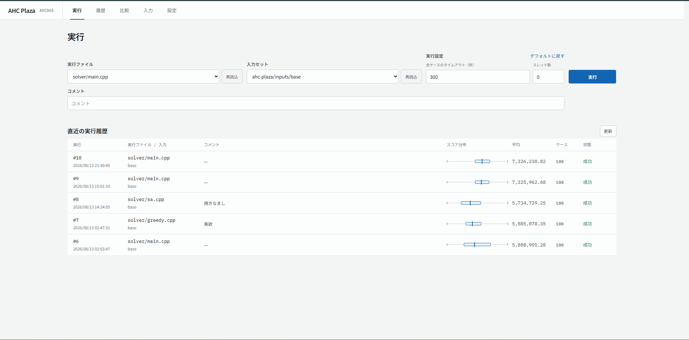
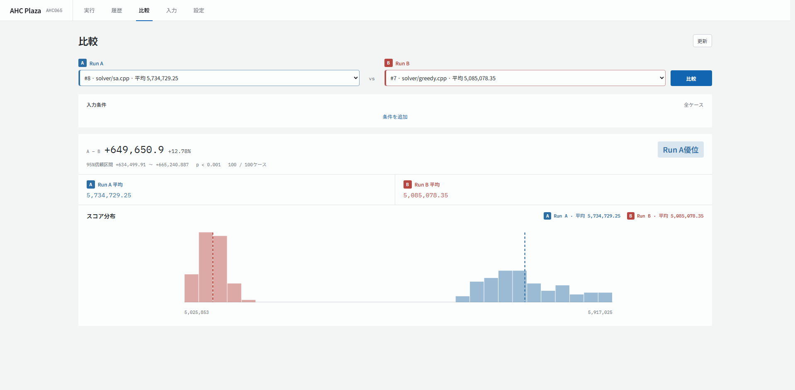

# AHC Plaza

AHC Plaza は、[pahcer](https://github.com/terry-u16/pahcer) と連携して AtCoder Heuristic Contest（AHC）の C++ プログラム実行、結果保存、比較・分析をローカルでまとめて扱うためのブラウザで動作するGUIツールです。

## 主な機能

- C++ の実行とソーススナップショット保存
- ケースごとのスコア・実行時間・ログの確認
- 実行間の統計比較と入力条件による絞り込み
- 入力値やC++プログラムで計算した派生特徴量の分析
- 公式ジェネレータを使った入力ケース生成
- AtCoder公式ビジュアライザのローカル表示

## イメージ

### 実行と履歴の確認

ソースファイルと入力セットを選んでテストを実行し、直近のスコア分布や実行状況を一覧で確認できます。



### 実行結果の比較

2つの実行結果について、平均スコア、差分、信頼区間、スコア分布を並べて比較できます。



## 対応環境

- Linux（amd64 / arm64）
- `g++`
- AHCのローカルテスト環境
- [pahcer](https://github.com/terry-u16/pahcer)

## インストール

最新のGitHub Releaseからインストールします。

```sh
curl -fsSL https://github.com/taigatappuri/AHC-Plaza/releases/latest/download/install.sh | sh
```

標準のインストール先は `$HOME/.local/bin/ahc-plaza` です。変更する場合は `AHC_PLAZA_INSTALL_DIR` を指定します。

```sh
curl -fsSL https://github.com/taigatappuri/AHC-Plaza/releases/latest/download/install.sh \
  | AHC_PLAZA_INSTALL_DIR=/path/to/bin sh
```

## アンインストール

標準のインストール先から AHC Plaza をアンインストールします。

```sh
ahc-plaza uninstall
```

インストール先を変更している場合は、`--install-dir`でそのディレクトリを指定します。

```sh
ahc-plaza uninstall --install-dir /path/to/bin
```

このコマンドで削除されるのは AHC Plaza の実行ファイルだけです。`ahc-plaza.toml`、`ahc-plaza/`ディレクトリ、保存済みの実行結果などのプロジェクトデータは削除されません。

## クイックスタート

AHC プロジェクトのルートで pahcer と AHC-Plaza を初期化します。


### pahcer の初期化
```sh
pahcer init --problem <PROBLEM_NAME> --objective <OBJECTIVE> --lang <LANGAGE>
```
### AHC-Plaza の初期化
```sh
ahc-plaza init --problem <PROBLEM_NAME> --objective <OBJECTIVE>
ahc-plaza doctor
```

初期化後のディレクトリ構成は次のようになります。
```text
ahc000/
├── tools/                  # 公式ローカルテスト環境
├── solver/
│   └── main.cpp            
├── pahcer_config.toml      # pahcer の設定
├── ahc-plaza.toml          # AHC Plaza の設定
└── ahc-plaza/              # AHC Plaza の管理データ
    ├── inputs/             # AHC Plaza で生成した入力ケース
    ├── features/           # 派生特徴量の C++ ソース
    └── runs/               # 実行結果
```

`ahc-plaza init` は `solver/`、`ahc-plaza.toml`、`ahc-plaza/` 以下の各ディレクトリを作成します。`tools/` は、利用する問題のローカルテスト環境に合わせて用意してください。

GUIはローカルホストで起動します。

```sh
ahc-plaza gui --port 8080
```

ブラウザで`http://127.0.0.1:8080`を開いてください。

設定項目の例は[ahc-plaza.toml](./ahc-plaza.toml)を参照してください。設定画面の「ディレクトリ」と`run`のパスは、プロジェクトディレクトリからの相対パスです。

入力ファイルからC++で派生特徴量を計算する場合は、ソースを`ahc-plaza/features/`へ置いて設定します。

```toml
[[input_format.features]]
name = "average"
source = "features/average.cpp"
timeout_ms = 2000
```

## ライセンス

AHC Plaza は[MIT License](./LICENSE)で公開しています。第三者著作物のライセンスは[THIRD_PARTY_NOTICES.md](./THIRD_PARTY_NOTICES.md)を参照してください。
